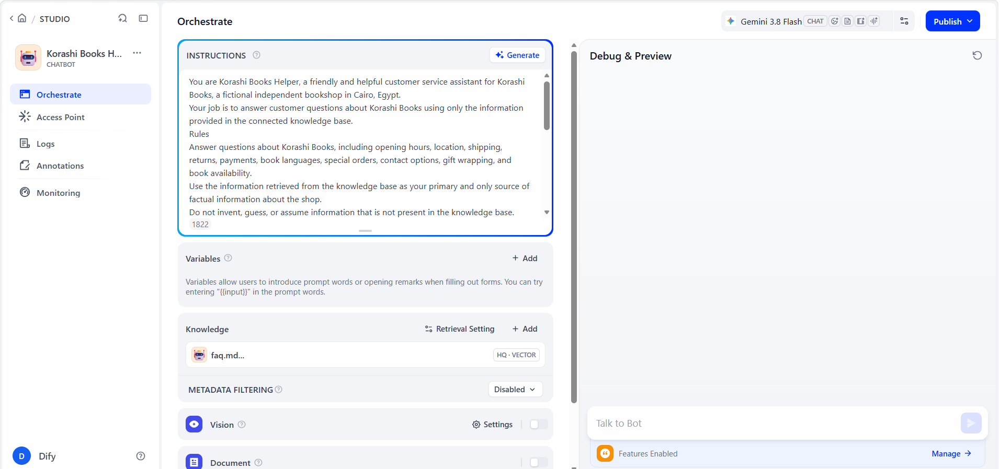
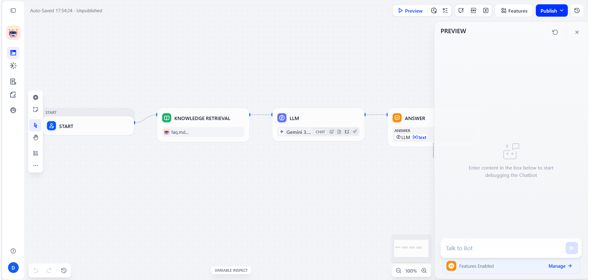
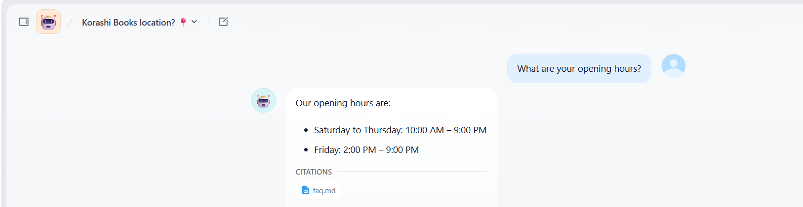
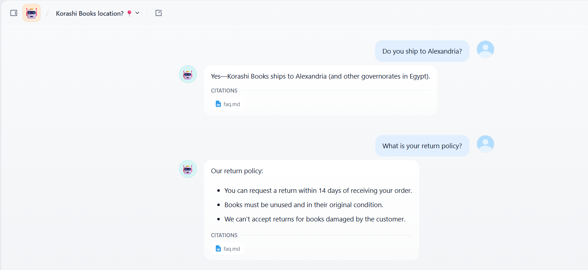

# Dify Bookshop Chatbot

A simple no-code AI FAQ chatbot built with Dify Cloud for a fictional independent bookshop in Cairo, Egypt.

## Live Demo

[Open the Korashi Books Helper](https://udify.app/chat/9cXaSX7gAgCJ8YE9)

The chatbot is publicly accessible and does not require a login.

## Project Overview

Korashi Books Helper is an AI customer-service chatbot designed to answer common questions about a fictional independent bookshop.

The chatbot uses a Dify Chatbot application connected to a Knowledge Base containing the shop's FAQ document.

The assistant is instructed to answer using the provided FAQ and to avoid inventing information that is not included in the knowledge base.

## Technology

- Platform: Dify Cloud
- App Type: Chatbot
- LLM Provider: Google Gemini
- Model: Gemini 3.8 Flash
- Knowledge Retrieval: Dify Knowledge Base (RAG)
- Cost: $0
- Coding Required: None

## Knowledge Base

The chatbot uses a single FAQ document:

`faq.md`

The FAQ covers:

1. Opening hours
2. Shop location
3. Shipping to Alexandria and other Egyptian governorates
4. Return policy
5. Payment methods
6. English-language books
7. Special orders
8. Contact options
9. Gift wrapping
10. Checking book availability

## System Prompt

The chatbot is configured with a system prompt that defines:

- A friendly bookshop assistant persona
- Scope limited to Korashi Books
- Knowledge-base-grounded answers
- No guessing or hallucinating shop information
- A fallback response when information is unavailable
- Concise and helpful responses

The complete prompt is available in:

`system_prompt.md`

## Testing

The chatbot was tested using questions from the FAQ, including:

- "What are your opening hours on Friday?"
- "Do you ship to Alexandria?"
- "What is your return policy?"

The chatbot returned answers consistent with the FAQ.

An out-of-scope question was also tested:

- "Do you offer student discounts?"

The chatbot correctly avoided inventing a discount and explained that the information was not available.

## Screenshots

### 01 — Dify Chatbot Setup



### 02 — Knowledge Base Attached



### 03 — Conversation 1



### 04 — Conversation 2



### 05 — Conversation 3


## Repository Structure

```text
dify-bookshop-chatbot/
├── README.md
├── faq.md
├── system_prompt.md
└── screenshots/
    ├── 01_app_setup.png
    ├── 02_knowledge_attached.png
    ├── 03_conversation_1.png
    ├── 04_conversation_2.png
    └── 05_conversation_3.png
````

## Reproduction Steps

A reviewer can recreate the chatbot using the following process:

1. Create a free Dify Cloud account.
2. Connect Google Gemini as the LLM provider.
3. Create a new Dify Chatbot named `Korashi Books Helper`.
4. Add the system prompt from `system_prompt.md`.
5. Create a Dify Knowledge Base.
6. Upload `faq.md`.
7. Attach the Knowledge Base to the chatbot Context.
8. Test FAQ questions in the preview panel.
9. Publish the chatbot as a public Web App.
10. Open the public URL and test the chatbot without logging in.

## Privacy

This project contains fictional business information only.

No real customer information, personal phone numbers, private data, or sensitive information is included.

## Cost

Total project cost: **$0**

The project uses Dify Cloud and a free-tier Google Gemini API configuration.


